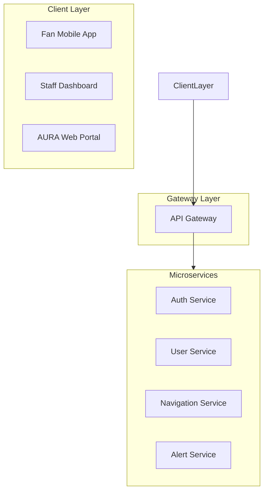

# AURA – System Architecture Specification

## Overview
AURA (AI Unified Real-time Assistant) is designed on a microservice architecture, allowing independent scaling of core operations.

```mermaid
graph TD
    subgraph Client Layer
        FanApp[Fan Mobile App]
        StaffDash[Staff Dashboard]
        WebPortal[AURA Web Portal]
    end

    subgraph Gateway Layer
        Gateway[API Gateway]
    end

    subgraph Microservices
        Auth[Auth Service]
        Users[User Service]
        Nav[Navigation Service]
        Alerts[Alert Service]
    end

    ClientLayer --> Gateway
    Gateway --> Microservices
```
